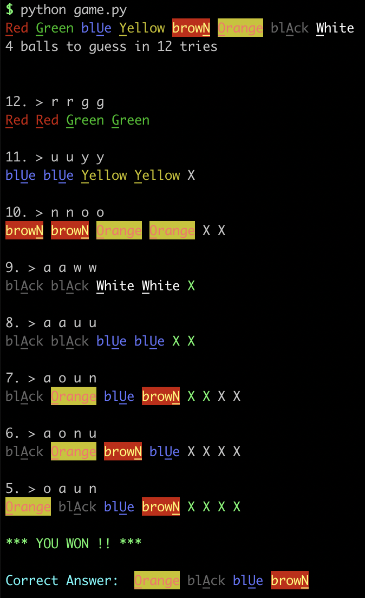
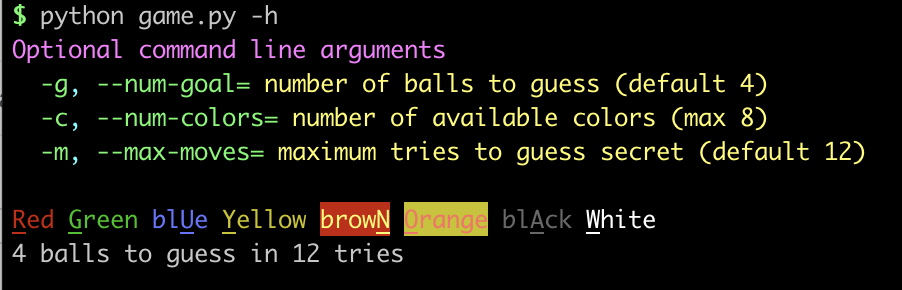
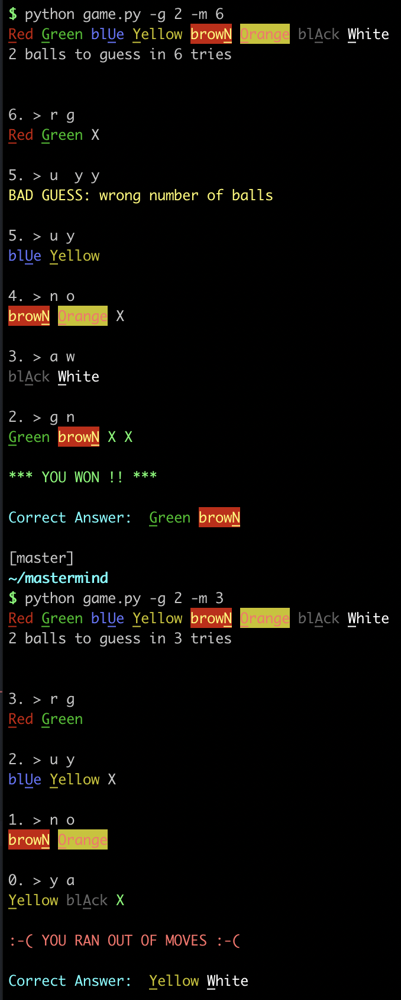
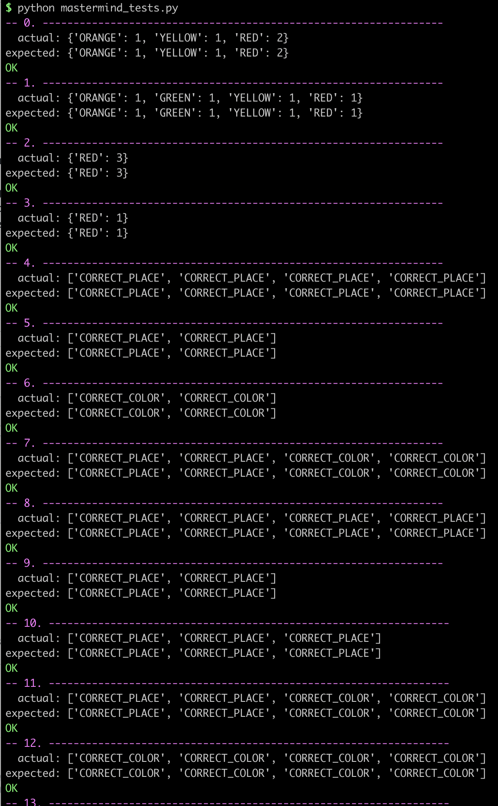
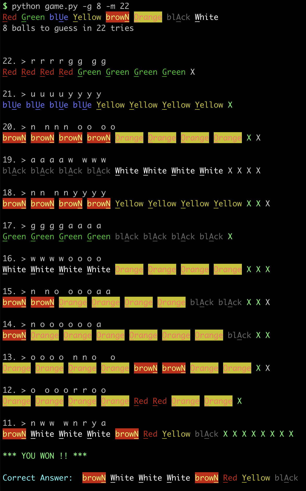

# Master Mind

A single-player logic-based guessing game played on the command line. Based on [this boardgame](https://en.wikipedia.org/wiki/Mastermind_(board_game)).

## Rules and Example

Let's start with the default game:
* The are 4 secret balls whose colors and order we need to guess
* There are 8 possible colors for each ball
* We have 12 tries to guess the secret correctly

Whenever we make a guess, starting at 12 and counting down to 0, the game gives us some imperfect feedback in the form of X's:
* A green X signifies that one of the guessed balls is in the correct location
* A grey X signifies that one of a guessed ball is the correct color, but not in the correct location

Note: the placement of X's does not match the guess. All of the green X's are shown first, followed by all of the grey X's

Consider the following example game:



On our first try (guess #12) we guess RED RED GREEN GREEN, using abbreviations shown by the underlined and capitalized letter of each color: "r r g g" - There are no X's, indicating that none of the secret balls are red or green.

**Syntax of guesses:**
- Capitalization doesn't matter
- You can type the entire color name, or the underlined letter
- You can also enter the numerical order of the color
- Multiple spaces are ok (for those of us crying over our keyboards)
- These all work:
   - `RE   re  g GR`
   - `red RED gReeN  Green`
   - `0 0 1 1`

*Explanation of the rest of the game, including  strategy*

On guess #8 we guess "black black blue blue" because want to check if black is responsible for the green X in guess #9 and blue for the grey X in guess #11.  By moving the blue ball to the other side of the row, we hope for that grey X to become green.

Guess #8 is lucky: it shows us that both the black and blue balls are correct. We don't know the exact placement, but we do know that the secret contains both a blue and a black ball, and we've narrowed the correct location for each to only 2 slots.

In guess #7 we make a guess for where the black and blue balls are, and then because we know that two colors come from the two grey X's in guess #10, we add one orange and one brown ball, fliipped to turn those two grey X's into greens.

The resulting two green X's and two grey X's tell us that two balls are in the correct place and two are not.

We don't know whether the left pair is correct or the right pair, so we randomly try switching the right pair in guess #6. That produces 4 grey X's -- oops! -- so now we know when looking at guess  #7 that it is the left pair that needs to be switched.

We make that correction in guess #5. Our powers of deduction are rewarded by winning the game!

## Installing and running the game

This game contains zero dependences. You need only clone this repo and you're ready to play.

You can run the game with default settings by calling:

`python game.py`

This starts a game with:
* 4 balls to guess (as in, the secret is 4-balls long)
* 8 possible colors for each ball (so the secret is 4 bytes)
* 12 tries



Here's an example using command line arguments to start two games in which the secret is 2 balls long:
1. In the first game, the player has 6 tries to guess the secret, and succeeds!
2. In the second game, the player has 3 tries to guess the secret, and fails :-(



## Running the tests

You can run the tests by calling:

`python mastermind_tests.py`

This executes 15 unit tests ensuring that the primary game logic -- giving X feedback for guesses -- is bug free.



## Salient design decisions and todos

This is a simple project, ostensibly written while helping a friend learn to program, but also as an excuse to improve upon the free online version I occaissionally play, which doesn't have keyboard shortcuts and limits the secret size and available guesses.

This simple, dependency-less project has three files:

- mastermind.py contains a single class, `Board`, which contains all of the game logic and state
- mastermind_tests.py contains unit tests for Board
- game.py handles command line arguments and instantiates a Board instance and calls play

Thoughts:

The Board class was originally immutable. Each instance created a secret, and then guesses were made and discarded. Eventually I added logic for counting moves and a more playable user experience. It could be nice to save guesses, and create a visually appealling board rather than a command line log, though as I find it playable as-is I'm not planning to make any more improvements. I leave it up to students to recreate as a web or mobile app.

The Board class is well organized in terms of state and single-purpose testable methods, however the user presentation is mixed up with the game logic and state. This intermingling makes it harder to test and extend this program. Using a MVC (model, view, controller) design pattern would be helpful, and is one benefit of moving this game into a mobile app or web framework.

## Another game example

Here's a game where we have to guess 8 balls



The first four guesses, #18-#15, try all of the colors in pairs.

The next few guesses narrow down exactly how many balls of each color are in the secret.

Using blue balls as empty placeholders, guess #14 tells us that there is one green ball, and by deduction, one red ball:

```
[g .] . . [r . . .]
```

The above notation is a short hand for what we've learned: there is one green ball in the left two spots, and one red ball on the right half.

Guess #13 tells us there are two orange balls, one on the left half and one on the right of the secret (and no browns):

```
[o . . .][r o . .]
[g .]
```

Guesses #12 tells us multiple things:
- There are two black balls, one on the left half and one on the right of the secret
- There are two white balls, also divided onto the left and right sides

```
[o a w .][r o a w]
[g .]
```

Guesses #11, #10 and #9 narrow down which balls are in which quarter of the secret.

#11 tells us the left hand black ball is with green on the left quarter, and thus organge and white  make up the second quarter.
```
[g a][o w][r o a w]
```

#10 tells us that black and orange are in the third and fourth quarters, respectively, however we don't know which is paired with red and which is paired with white.

```
[g a][o w][r w  . .]
          [a .][o .]
```

#9 tells us that red is paired with balck.
```
[g a][o w][r a][o w]
```

In guess #8, I went ahead and made the full guess of what we had, knowing that we could flip individual pairs one-by-one until we found the exact right ordering.

We go lucky: all balls were in the wrong place, thus I flipped all pairs and guessed the secret correctly.
